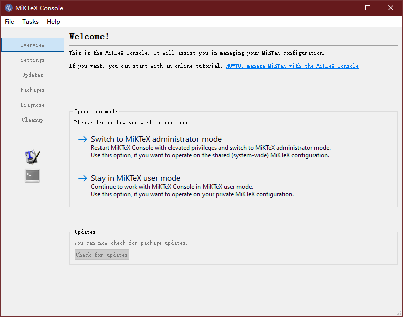
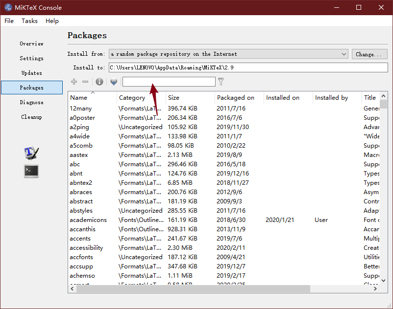
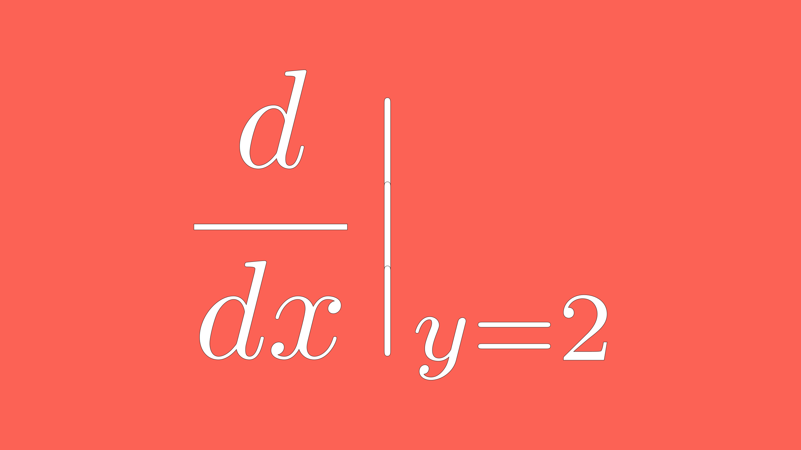
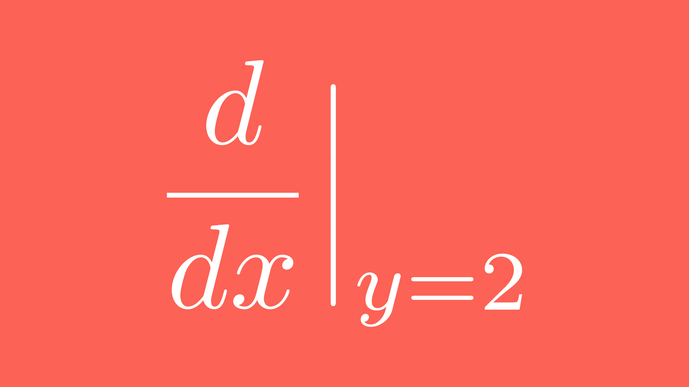

FAQ
====

本节结合个人的经验,部分参考 **manim交流群** (862671480) 的文档,该文档由 `鹤翔万里` 和 `catfish` 编写.

.. attention:: 此节不仅包含了安装时出现的问题,也包含了各种其他问题,若暂时没有遇到或不需要则不必要看.

LaTex问题
-----------

如果你尝试编译 ``example_scenes.py`` 中的其他动画类,出现报错 ``Latex error converting to dvi`` 的话,那就对了.

LaTex是非常折腾的东西,但如果你熟悉了的话也就那样吧.这里报错最大的问题其实是LaTex的一些宏包没有安装好,而很多MiKTeX宏包安装是连接到国外的服务器.如果你科学上网的话,这里应该不成问题,因为Latex会自动安装缺失的宏包.如果没有的话,因为连接超时下载不到宏包无法正确编译而报错.

解决方案一:科学上网!这是最佳方案,因为可以持续更新宏包!

解决方案二:手动安装或者更换镜像源! `这里 <https://www.zhihu.com/question/26584112>`_ 有一些解决方案!

Manim编译需要的LaTex宏包你可以在 ``/manimlib/tex_template.tex`` 和 ``/manimlib/ctex_template.tex`` 中找到;前者是英文模板,后者是中文模板.怎么使manim支持中文,后面会讲到.

你可以打开电脑中的MiKTeX Console:

选择 ``Switch to MiKTeX Console administrator mode`` 进入管理员模式,点击左手边的 ``Package`` . 

在上面的方框中输入宏包名称来检查该宏包是否安装.

使LaTex支持更多的Latex宏包/字体
----------------------------

参考 `Manim fast tutorial - How to add more LaTeX packages? <Manim fast tutorial - How to add more LaTeX packages?>`_

更改 ``/manimlib/tex_template.tex`` 或者 ``/manimlib/ctex_template.tex`` 模板即可.但如果你不熟悉LaTex请不要随便更改!

以我的LaTex模板为例:

.. code-block:: latex
    :emphasize-lines: 19-33, 35-37
    :linenos:

    /documentclass[preview]{standalone}

    /usepackage[english]{babel}
    /usepackage{amsmath}
    /usepackage{amssymb}
    /usepackage{dsfont}
    /usepackage{setspace}
    /usepackage{tipa}
    /usepackage{relsize}
    /usepackage{textcomp}
    /usepackage{mathrsfs}
    /usepackage{wasysym}
    /usepackage{ragged2e}
    /usepackage{physics}
    /usepackage{listings}
    /usepackage{xcolor}
    % /usepackage{microtype}

    %% 字体设置
    /usepackage[T1,OT1]{fontenc}
    /usepackage{palatino}  % english defalut font
    /usepackage{calligra}  % hand-writing /calligra
    /newcommand{/sz}[1]{/fontencoding{OT1}/fontfamily{pplj}/fontseries{m}/selectfont #1}   % non-aligned number
    /newcommand{/gt}[1]{/fontencoding{OT1}/fontfamily{pgoth}/fontseries{m}/selectfont #1}  % Gothic font

    %% xelatex font
    /usepackage{fontspec}
    /usepackage{xeCJK}
    /setCJKmainfont[BoldFont={Noto Sans S Chinese}]{Noto Serif CJK SC}
    /setCJKmonofont{Noto Serif CJK SC}
    /setCJKsansfont{Noto Serif CJK SC SemiBold}  % /sf Chinese title font
    /setmainfont{Palatino-Roman}    % /sf English hand-writing font
    /setsansfont{Zapfino}

    %% 绘图工具
    /usepackage[siunitx,RPvoltages,european]{circuitikz}
    /usepackage{tikz}

    % /DisableLigatures{encoding = *, family = * }

    /linespread{1}

    /begin{document}

    YourTextHere

    /end{document}

**字体设置** :这里可以自定义字体,不详细展开.

**绘图工具** :如果要使Tikz或者CircuiTikz的绘图正确显示,需要更改绘图的填充,否则不能在manim编译的动画中正确显示,因为manim会自动滤除颜色.对于一些LaTex自带的符号也是如此!如果你发现LaTex编译没有问题,那很大程度上的问题就是填充透明度等有问题.

有兴趣的可以尝试一下:

.. warning:: 需要在英文模式下,也就是 ``TEX_USE_CTEX=False`` 的情况下编译!因为中文情况下的处理会出现问题!

.. code-block:: python

    class TikzMobject(TextMobject):
        CONFIG = {
            "stroke_width": 1,
            "fill_opacity": 1,
            "stroke_opacity": 1,
        }

    class ExampleTikz(Scene):
        def construct(self):
            circuit = TikzMobject(r"""
                /begin{circuitikz}[american voltages]
                /draw
                (0,0) to [short, *-] (6,0)
                to [V, l_=$/mathrm{j}{/omega}_m /underline{/psi}^s_R$] (6,2) 
                to [R, l_=$R_R$] (6,4) 
                to [short, i_=$/underline{i}^s_R$] (5,4) 
                (0,0) to [open,v^>=$/underline{u}^s_s$] (0,4) 
                to [short, *- ,i=$/underline{i}^s_s$] (1,4) 
                to [R, l=$R_s$] (3,4)
                to [L, l=$L_{/sigma}$] (5,4) 
                to [short, i_=$/underline{i}^s_M$] (5,3) 
                to [L, l_=$L_M$] (5,0); 
                /end{circuitikz}
                """)
            self.play(Write(circuit))
            self.wait()

中文支持问题
-------------

首先要确保你的LaTex能够正常编译!在 ``manimlib/constants.py`` 找到 ``TEX_USE_CTEX`` 设置为 ``True``.

如果你的LaTex在英文模式下能够正常编译的话,这里应该问题就不大了.如果出现 ``xeLatex error converting to dvi`` 报错,很大程度上还是宏包问题.这里中文使用的是 ``ctex`` 宏包,要注意有没有安装.

LaTex实在有很多可以讲的,这一块都能单独写好几本书了,我们放到后面.网上有很多资料和书籍,需要大家多多学习和折腾!

字体问题
----------

如果你不想通过改变LaTex模板来设置字体,你可以参考 `xy-23` 编写的一个新的 `类 <https://github.com/3b1b/manim/pull/680>`_.

但有个问题是输出的图片并非矢量,所以效果会差一点.

编译过慢问题
-------------

Manim编译有时候会很慢,如果你的电脑上有GPU的话,那恭喜你!你可用GPU来加速!在你的文件中添加如下代码:

.. code-block:: python

    import os

    def set_gpus(gpu_index):
        if type(gpu_index) == list:
            gpu_index = ','.join(str(_) for _ in gpu_index)
        if type(gpu_index) ==int:
            gpu_index = str(gpu_index)
        os.environ["CUDA_VISIBLE_DEVICES"] = gpu_index

然后在你的动画类的 ``def construct(self):`` 下面写一行代码: ``set_gpus(0)`` 或者 ``set_gpus([0,1])`` 如果你是土豪有两块GPU的话!

有了GPU的加持,你会体验到编译速度的飞跃,但对于大规模的计算场景,如多个对象淡出、Update动画等,速度会回归龟速.

编译动态条问题
--------------

如果你不喜欢编译时的动态条,可以参考 `Manim tutorial | Settings - Leave the progress bars by default <https://www.youtube.com/watch?v=K8dVFqXR2JM>`_ 去除.

# TODO:完善细节.

如何改变视频输出地址
--------------------

个人不建议更改!默认就好,方便管理. 如果要更改,可以参考 `Manim tutorial | Settings - Change media directory <https://www.youtube.com/watch?v=I9rHHiKqTWY>`_ 设置.

# TODO:完善细节.

如何在终端中设置输出的帧率
-------------------------

参考 `Manim tutorial | Settings - Render faster, set FPS via terminal <https://www.youtube.com/watch?v=cyIz0Oh3lWY>`_ 进行设置.

# TODO:完善细节.

添加声音、SVG和图像
------------------

参考 `Manim tutorial | 7 - Add sounds, svgs and images <https://www.youtube.com/watch?v=tsMGRN3ZfAg>`_ 进行设置.

添加声音
#########

# TODO: 完善细节

添加SVG
#########

# TODO: 完善细节

添加图像
#########

# TODO: 完善细节

如何改变背景颜色 [1]_
----------------------

.. code-block:: python

    class ChangeBackgroundColor(Scene):
        CONFIG={
            "camera_config":{"background_color":RED}, # 改变背景色
            "text":TexMobject(r"/frac{d}{dx}/Bigr|_{y=2}").scale(5)
        }
        def construct(self):
            self.add(self.text)

如何去除字符的描边 [1]_
-----------------------

.. code-block:: python

    class RemoveBackgroundStrokeWidth(ChangeBackgroundColor):
        CONFIG={
            "text":TexMobject(
                r"/frac{d}{dx}/Bigr|_{y=2}",
                background_stroke_width=0, # 设置描边粗细 
                ).scale(5)
        }

gif输出问题
-----------

manimlib中的gif输出是没有问题的,但最新的manim repo进行更新后没有办法正确输出gif(至少我是这样的),如果你也遇到相同的情况,只需要把相关的设置改回去就可以了.

你需要安装manimlib这个包,找到 ``manimlib/config.py`` 跟克隆下来的manim仓库中的 ``manimlib/config.py`` 进行比对,参照 `更新 <https://github.com/3b1b/manim/pull/529/files>`_ 进行更改.

你可以直接在我的Repo上下载这个 `文件 <https://github.com/WRangers/manim/blob/master/manimlib/config.py>`_ 进行替换.

.. [1] `AnimationsWithManim/English/extra/faqs/faqs.md <https://github.com/Elteoremadebeethoven/AnimationsWithManim/blob/master/English/extra/faqs/faqs.md>`_