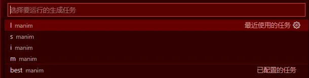

VS Code配置
============

此节基于Bilibili Up主<pdcxs>的文章: `配置Manim自动编译环境(仅限VS Code Win) <https://www.bilibili.com/read/cv4152112>`_ .

如果你使用的是Visual Studio Code的话,可以配置自动编译,而不需要每一次手动输入 ``python manim.py example_scenes.py SquareToCircle -pl`` 这样一长串的代码.

配置tasks.json
################

在工作目录下的 ``.vscode`` 中(如果没有就创建一个)创建一个 ``tasks.json`` 文件(如果已经有了,直接修改即可).

.. literalinclude:: /manimlib/tasks_settings.py
    :lines: 1-85
    :lineno-start: 1
    :emphasize-lines: 5,12

每一个任务都有一个标签(可以自定义修改),与其任务的输出格式是相对应的;如第 ``5`` 行的 ``l`` 代表的是低分辨率输出,相应的 第 ``12`` 行 ``-pl`` 代表低分辨率渲染,并用默认播放器打开;其他任务同理.

* ``l`` :低分辨渲染
* ``m`` :中分辨渲染
* ``b`` :最高分辨渲染,输出品质
* ``i`` :输出gif格式
* ``s`` :低分辨率保存最后一帧

可以自定义添加更多的指令.渲染指令请参考渲染设置.

配置compile_shell.py
######################

在主工作目录下,添加 ``compile_shell.py`` 文件.这个文件是用于寻找当前要编译的动画类的名称.

.. literalinclude:: /manimlib/compile_shell.py
    :lines: 1-27
    :lineno-start: 1
    :emphasize-lines: 21

第 ``20-26`` 行是编译的命令,第 ``21`` 行是指定的编译器,由于我的电脑同时安装了Anaconda和Python,为了避免冲突,这里可以自行指定编译器;你需要自行替换一下.如果选择使用默认的Python,把第 ``21`` 行改为 ``python`` 即可.

这里的机制是在你的鼠标所在行向上搜索类的名称,然后放入命令行进行自动编译.原参考的解决方案是使用Poweshell,这对于非Windows平台是不支持的,这里改成Python脚本.理论上来说,只要能装上VS Code,都能实现这样的自动编译.

用法
#######

鼠标放在要编译的manim动画代码中的任意一行,按下默认快捷键是 ``Ctrl+Shift+B`` ,会出现窗口:

   
通过鼠标或者键盘选择相应的任务即可.
